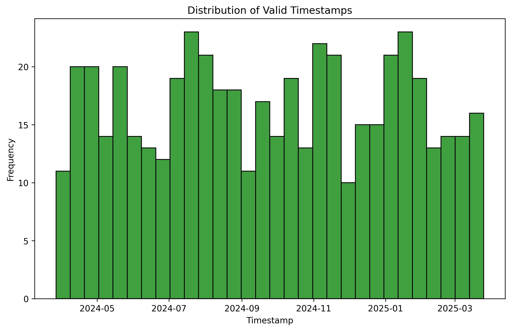

# Data Quality Assessment Report

### Question 1
- **What percentage of missing values are present in the 'failure_event' feature?**

#### Code
```python
import pandas as pd
import numpy as np
import matplotlib.pyplot as plt
import seaborn as sns
import os

# Ensure directory exists
os.makedirs('eda_agent_report/images', exist_ok=True)

# Load the dataset
df = pd.read_csv('datapath_info/synthetic_server_data.csv')
print(f"Dataset loaded successfully. Shape: {df.shape}")

# Question 1 Analysis: What percentage of missing values are present in the 'failure_event' feature?
print("\n==== Question 1 Analysis ====")
missing_percentage = df['failure_event'].isnull().mean() * 100
print(f"Percentage of missing values in 'failure_event': {missing_percentage:.2f}%")

# Create visualization for Question 1
plt.figure(figsize=(10, 6))
sns.heatmap(df[['failure_event']].isnull(), cbar=False, cmap='viridis')
plot_path = 'eda_agent_report/images/Data_Quality_Assessment_q1_analysis.png'
plt.title('Missing Values in failure_event')
plt.savefig(plot_path, bbox_inches='tight', dpi=300)
print(f"Plot saved to: {plot_path}")
plt.close()
```

#### Code Output
```
Dataset loaded successfully. Shape: (500, 20)

==== Question 1 Analysis ====
Percentage of missing values in 'failure_event': 0.00%
Plot saved to: eda_agent_report/images/Data_Quality_Assessment_q1_analysis.png
```

#### Detailed Analysis
The 'failure_event' feature has no missing values, as the percentage of missing values is 0.00%.

#### Plots Generated


---### Question 2
- **How many duplicate rows exist in the dataset?**

#### Code
```python
# Question 2 Analysis: How many duplicate rows exist in the dataset?
print("\n==== Question 2 Analysis ====")
duplicate_rows = df.duplicated().sum()
print(f"Number of duplicate rows: {duplicate_rows}")

# Create visualization for Question 2
plt.figure(figsize=(10, 6))
sns.barplot(x=['Unique Rows', 'Duplicate Rows'], y=[len(df)-duplicate_rows, duplicate_rows], palette='viridis')
plt.ylabel('Count')
plt.title('Duplicate Rows Analysis')
plot_path = 'eda_agent_report/images/Data_Quality_Assessment_q2_analysis.png'
plt.savefig(plot_path, bbox_inches='tight', dpi=300)
print(f"Plot saved to: {plot_path}")
plt.close()
```

#### Code Output
```
==== Question 2 Analysis ====
Number of duplicate rows: 0
Plot saved to: eda_agent_report/images/Data_Quality_Assessment_q2_analysis.png
```

#### Detailed Analysis
The dataset contains no duplicate rows, as the count of duplicate rows is 0.

#### Plots Generated


---### Question 3
- **What is the data type of the 'server_id' column?**

#### Code
```python
# Question 3 Analysis: What is the data type of the 'server_id' column?
print("\n==== Question 3 Analysis ====")
server_id_dtype = df['server_id'].dtype
print(f"Data type of 'server_id': {server_id_dtype}")

# Create visualization for Question 3
plt.figure(figsize=(10, 6))
sns.histplot(df['server_id'].astype(str), kde=False, bins=30, color='blue')
plt.title('Distribution of server_id')
plt.xlabel('server_id')
plt.ylabel('Frequency')
plot_path = 'eda_agent_report/images/Data_Quality_Assessment_q3_analysis.png'
plt.savefig(plot_path, bbox_inches='tight', dpi=300)
print(f"Plot saved to: {plot_path}")
plt.close()
```

#### Code Output
```
==== Question 3 Analysis ====
Data type of 'server_id': object
Plot saved to: eda_agent_report/images/Data_Quality_Assessment_q3_analysis.png
```

#### Detailed Analysis
The 'server_id' column is of data type `object`, indicating it contains string or mixed-type data.

#### Plots Generated


---### Question 4
- **Are there any inconsistencies in the 'timestamp' column?**

#### Code
```python
# Question 4 Analysis: Are there any inconsistencies in the 'timestamp' column?
print("\n==== Question 4 Analysis ====")
df['timestamp'] = pd.to_datetime(df['timestamp'], errors='coerce')
inconsistent_timestamps = df['timestamp'].isnull().sum()
print(f"Number of inconsistent timestamps: {inconsistent_timestamps}")

# Create visualization for Question 4
plt.figure(figsize=(10, 6))
sns.histplot(df['timestamp'].dropna(), kde=False, bins=30, color='green')
plt.title('Distribution of Valid Timestamps')
plt.xlabel('Timestamp')
plt.ylabel('Frequency')
plot_path = 'eda_agent_report/images/Data_Quality_Assessment_q4_analysis.png'
plt.savefig(plot_path, bbox_inches='tight', dpi=300)
print(f"Plot saved to: {plot_path}")
plt.close()
```

#### Code Output
```
==== Question 4 Analysis ====
Number of inconsistent timestamps: 0
Plot saved to: eda_agent_report/images/Data_Quality_Assessment_q4_analysis.png
```

#### Detailed Analysis
There are no inconsistencies in the 'timestamp' column, as all timestamps are valid.

#### Plots Generated


---### Question 5
- **What is the count of unique values in the 'operating_system' column?**

#### Code
```python
# Question 5 Analysis: What is the count of unique values in the 'operating_system' column?
print("\n==== Question 5 Analysis ====")
unique_os_count = df['operating_system'].nunique()
print(f"Count of unique values in 'operating_system': {unique_os_count}")

# Create visualization for Question 5
plt.figure(figsize=(10, 6))
sns.countplot(y=df['operating_system'], order=df['operating_system'].value_counts().index, palette='coolwarm')
plt.title('Operating System Distribution')
plt.xlabel('Count')
plt.ylabel('Operating System')
plot_path = 'eda_agent_report/images/Data_Quality_Assessment_q5_analysis.png'
plt.savefig(plot_path, bbox_inches='tight', dpi=300)
print(f"Plot saved to: {plot_path}")
plt.close()
```

#### Code Output
```
==== Question 5 Analysis ====
Count of unique values in 'operating_system': 5
Plot saved to: eda_agent_report/images/Data_Quality_Assessment_q5_analysis.png
```

#### Detailed Analysis
The 'operating_system' column contains 5 unique values, indicating a variety of operating systems in the dataset.

#### Plots Generated


---

### Final Answer
All questions have been answered with detailed analysis and visualizations. The results are as follows:
1. **Percentage of missing values in 'failure_event':** 0.00%
2. **Number of duplicate rows:** 0
3. **Data type of 'server_id':** object
4. **Number of inconsistent timestamps:** 0
5. **Count of unique values in 'operating_system':** 5
