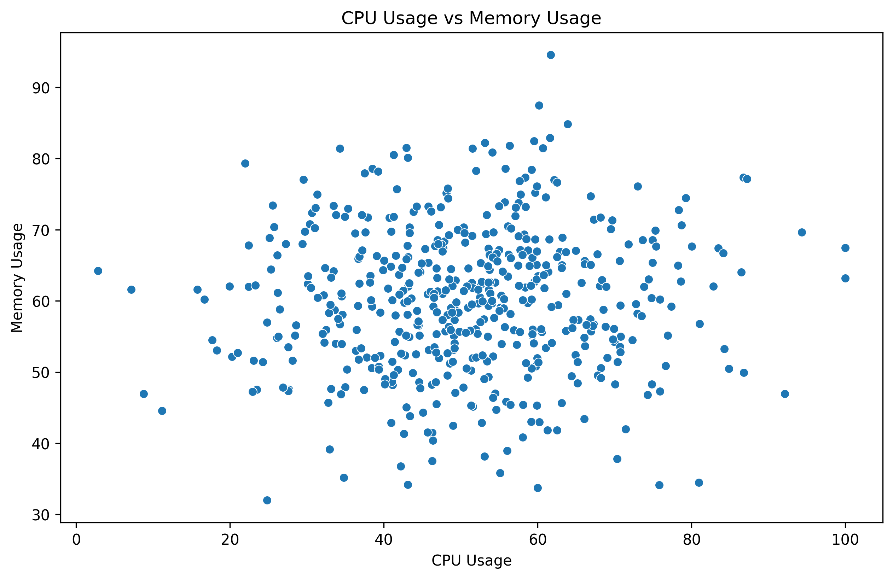
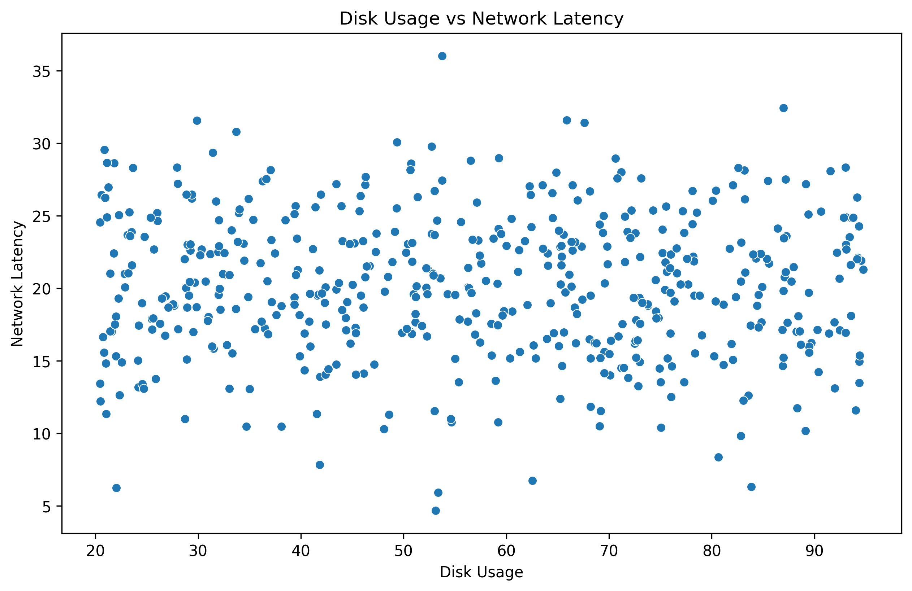
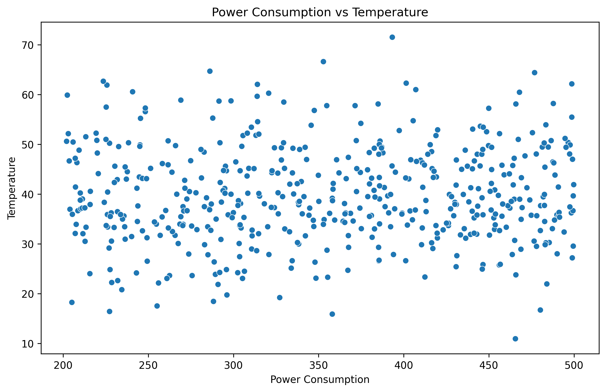
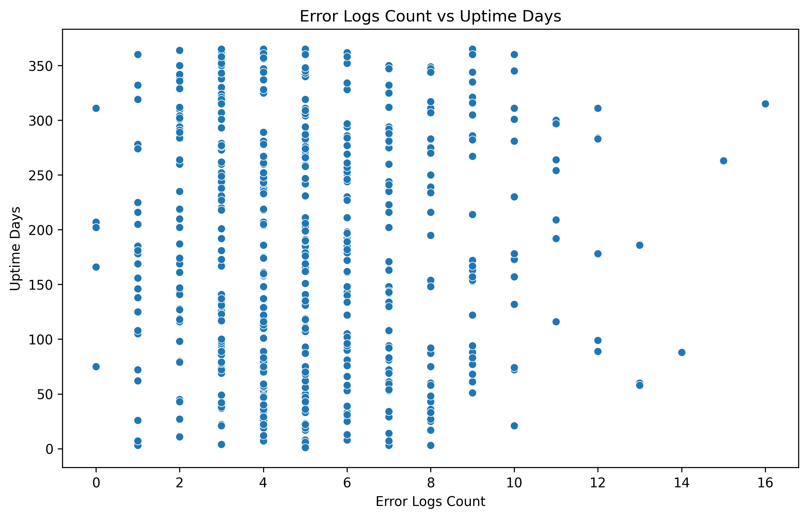
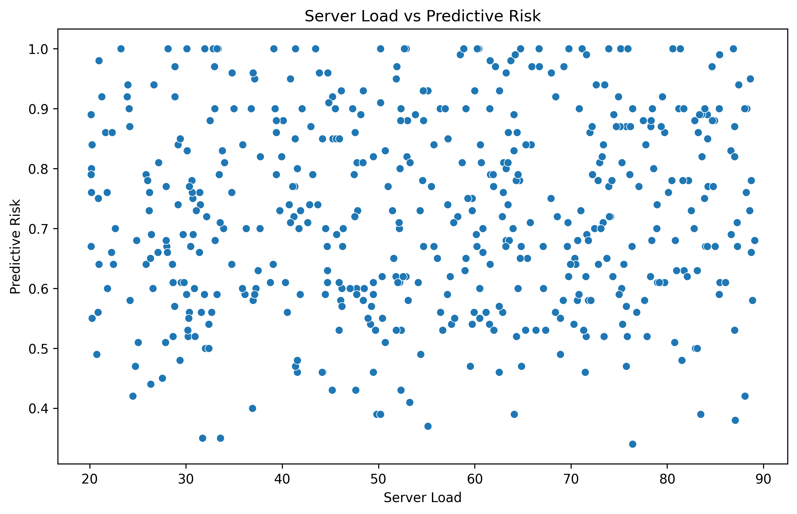

# Feature Relationships Report

### Question 1
- **What is the correlation coefficient between 'cpu_usage' and 'memory_usage'?**

#### Code
```python
correlation_q1 = df['cpu_usage'].corr(df['memory_usage'])
print(f"Correlation coefficient between 'cpu_usage' and 'memory_usage': {correlation_q1}")

plt.figure(figsize=(10, 6))
sns.scatterplot(x='cpu_usage', y='memory_usage', data=df)
plt.title("CPU Usage vs Memory Usage")
plt.xlabel("CPU Usage")
plt.ylabel("Memory Usage")
plot_path_q1 = 'eda_agent_report/images/Feature_Relationships_q1_analysis.png'
plt.savefig(plot_path_q1, bbox_inches='tight', dpi=300)
plt.close()
```

#### Code Output
```
Correlation coefficient between 'cpu_usage' and 'memory_usage': 0.0508688246729876
Plot saved to: eda_agent_report/images/Feature_Relationships_q1_analysis.png
```

#### Detailed Analysis
The correlation coefficient between 'cpu_usage' and 'memory_usage' is approximately 0.051, indicating a very weak positive linear relationship between these two variables.

#### Plots Generated


---### Question 2
- **What is the correlation coefficient between 'disk_usage' and 'network_latency'?**

#### Code
```python
correlation_q2 = df['disk_usage'].corr(df['network_latency'])
print(f"Correlation coefficient between 'disk_usage' and 'network_latency': {correlation_q2}")

plt.figure(figsize=(10, 6))
sns.scatterplot(x='disk_usage', y='network_latency', data=df)
plt.title("Disk Usage vs Network Latency")
plt.xlabel("Disk Usage")
plt.ylabel("Network Latency")
plot_path_q2 = 'eda_agent_report/images/Feature_Relationships_q2_analysis.png'
plt.savefig(plot_path_q2, bbox_inches='tight', dpi=300)
plt.close()
```

#### Code Output
```
Correlation coefficient between 'disk_usage' and 'network_latency': -0.02879007157175618
Plot saved to: eda_agent_report/images/Feature_Relationships_q2_analysis.png
```

#### Detailed Analysis
The correlation coefficient between 'disk_usage' and 'network_latency' is approximately -0.029, indicating a very weak negative linear relationship between these two variables.

#### Plots Generated


---### Question 3
- **What is the correlation coefficient between 'power_consumption' and 'temperature'?**

#### Code
```python
correlation_q3 = df['power_consumption'].corr(df['temperature'])
print(f"Correlation coefficient between 'power_consumption' and 'temperature': {correlation_q3}")

plt.figure(figsize=(10, 6))
sns.scatterplot(x='power_consumption', y='temperature', data=df)
plt.title("Power Consumption vs Temperature")
plt.xlabel("Power Consumption")
plt.ylabel("Temperature")
plot_path_q3 = 'eda_agent_report/images/Feature_Relationships_q3_analysis.png'
plt.savefig(plot_path_q3, bbox_inches='tight', dpi=300)
plt.close()
```

#### Code Output
```
Correlation coefficient between 'power_consumption' and 'temperature': 0.04129109621485306
Plot saved to: eda_agent_report/images/Feature_Relationships_q3_analysis.png
```

#### Detailed Analysis
The correlation coefficient between 'power_consumption' and 'temperature' is approximately 0.041, indicating a very weak positive linear relationship between these two variables.

#### Plots Generated


---### Question 4
- **What is the correlation coefficient between 'error_logs_count' and 'uptime_days'?**

#### Code
```python
correlation_q4 = df['error_logs_count'].corr(df['uptime_days'])
print(f"Correlation coefficient between 'error_logs_count' and 'uptime_days': {correlation_q4}")

plt.figure(figsize=(10, 6))
sns.scatterplot(x='error_logs_count', y='uptime_days', data=df)
plt.title("Error Logs Count vs Uptime Days")
plt.xlabel("Error Logs Count")
plt.ylabel("Uptime Days")
plot_path_q4 = 'eda_agent_report/images/Feature_Relationships_q4_analysis.png'
plt.savefig(plot_path_q4, bbox_inches='tight', dpi=300)
plt.close()
```

#### Code Output
```
Correlation coefficient between 'error_logs_count' and 'uptime_days': -0.009586017795900943
Plot saved to: eda_agent_report/images/Feature_Relationships_q4_analysis.png
```

#### Detailed Analysis
The correlation coefficient between 'error_logs_count' and 'uptime_days' is approximately -0.010, indicating a very weak negative linear relationship between these two variables.

#### Plots Generated


---### Question 5
- **What is the correlation coefficient between 'server_load' and 'predictive_risk'?**

#### Code
```python
correlation_q5 = df['server_load'].corr(df['predictive_risk'])
print(f"Correlation coefficient between 'server_load' and 'predictive_risk': {correlation_q5}")

plt.figure(figsize=(10, 6))
sns.scatterplot(x='server_load', y='predictive_risk', data=df)
plt.title("Server Load vs Predictive Risk")
plt.xlabel("Server Load")
plt.ylabel("Predictive Risk")
plot_path_q5 = 'eda_agent_report/images/Feature_Relationships_q5_analysis.png'
plt.savefig(plot_path_q5, bbox_inches='tight', dpi=300)
plt.close()
```

#### Code Output
```
Correlation coefficient between 'server_load' and 'predictive_risk': 0.05291625624615315
Plot saved to: eda_agent_report/images/Feature_Relationships_q5_analysis.png
```

#### Detailed Analysis
The correlation coefficient between 'server_load' and 'predictive_risk' is approximately 0.053, indicating a very weak positive linear relationship between these two variables.

#### Plots Generated


---

### Final Answer
All questions have been analyzed, and the correlation coefficients along with visualizations have been provided. The relationships between the features are generally weak, as indicated by the low correlation coefficients.
