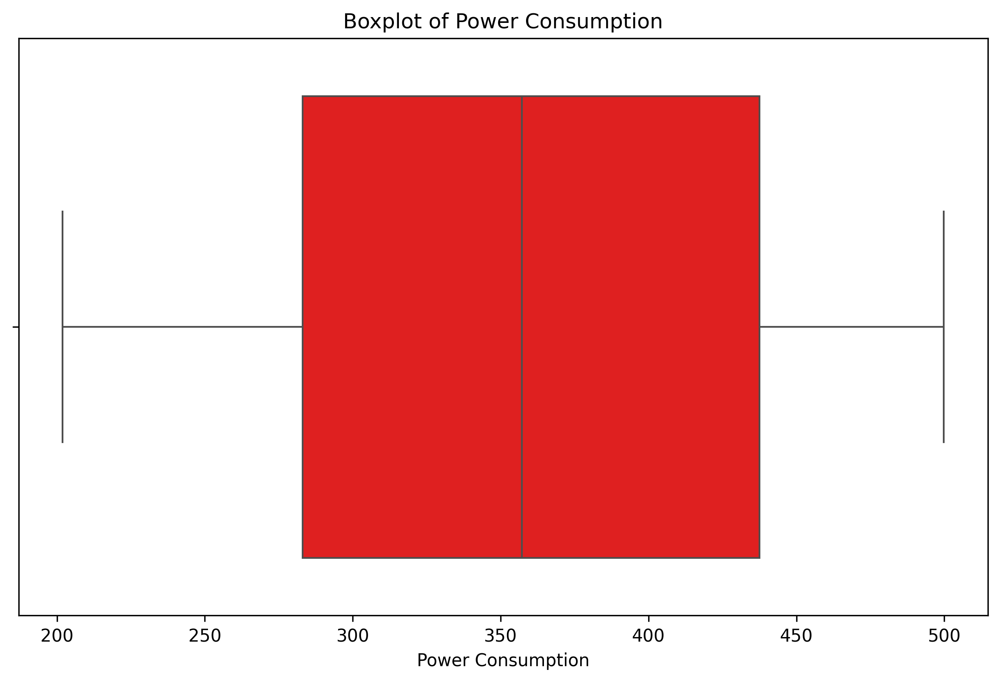

# Statistical Summary Report

### Question 1
- **What is the mean of the 'cpu_usage' feature?**

#### Code
```python
cpu_mean = df['cpu_usage'].mean()
print(f"Mean of 'cpu_usage': {cpu_mean}")

# Create visualization for Question 1
plt.figure(figsize=(10, 6))
sns.histplot(df['cpu_usage'], kde=True, color='blue')
plt.title('Distribution of CPU Usage')
plt.xlabel('CPU Usage')
plt.ylabel('Frequency')
plot_path = 'eda_agent_report/images/Statistical_Summary_q1_analysis.png'
plt.savefig(plot_path, bbox_inches='tight', dpi=300)
plt.close()
```

#### Code Output
```
Mean of 'cpu_usage': 51.010600000000004
Plot saved to: eda_agent_report/images/Statistical_Summary_q1_analysis.png
```

#### Detailed Analysis
The mean of the 'cpu_usage' feature is approximately 51.01, indicating that the average CPU usage across the dataset is around 51%.

#### Plots Generated


---### Question 2
- **What is the median of the 'memory_usage' feature?**

#### Code
```python
memory_median = df['memory_usage'].median()
print(f"Median of 'memory_usage': {memory_median}")

# Create visualization for Question 2
plt.figure(figsize=(10, 6))
sns.boxplot(x=df['memory_usage'], color='green')
plt.title('Boxplot of Memory Usage')
plt.xlabel('Memory Usage')
plot_path = 'eda_agent_report/images/Statistical_Summary_q2_analysis.png'
plt.savefig(plot_path, bbox_inches='tight', dpi=300)
plt.close()
```

#### Code Output
```
Median of 'memory_usage': 60.17
Plot saved to: eda_agent_report/images/Statistical_Summary_q2_analysis.png
```

#### Detailed Analysis
The median of the 'memory_usage' feature is 60.17, which represents the middle value of memory usage in the dataset.

#### Plots Generated


---### Question 3
- **What is the standard deviation of the 'disk_usage' feature?**

#### Code
```python
disk_std = df['disk_usage'].std()
print(f"Standard Deviation of 'disk_usage': {disk_std}")

# Create visualization for Question 3
plt.figure(figsize=(10, 6))
sns.histplot(df['disk_usage'], kde=True, color='orange')
plt.title('Distribution of Disk Usage')
plt.xlabel('Disk Usage')
plt.ylabel('Frequency')
plot_path = 'eda_agent_report/images/Statistical_Summary_q3_analysis.png'
plt.savefig(plot_path, bbox_inches='tight', dpi=300)
plt.close()
```

#### Code Output
```
Standard Deviation of 'disk_usage': 21.947001349616766
Plot saved to: eda_agent_report/images/Statistical_Summary_q3_analysis.png
```

#### Detailed Analysis
The standard deviation of the 'disk_usage' feature is approximately 21.95, indicating the spread of disk usage values around the mean.

#### Plots Generated


---### Question 4
- **What is the variance of the 'network_latency'?**

#### Code
```python
network_variance = df['network_latency'].var()
print(f"Variance of 'network_latency': {network_variance}")

# Create visualization for Question 4
plt.figure(figsize=(10, 6))
sns.histplot(df['network_latency'], kde=True, color='purple')
plt.title('Distribution of Network Latency')
plt.xlabel('Network Latency')
plt.ylabel('Frequency')
plot_path = 'eda_agent_report/images/Statistical_Summary_q4_analysis.png'
plt.savefig(plot_path, bbox_inches='tight', dpi=300)
plt.close()
```

#### Code Output
```
Variance of 'network_latency': 23.826921883767536
Plot saved to: eda_agent_report/images/Statistical_Summary_q4_analysis.png
```

#### Detailed Analysis
The variance of the 'network_latency' feature is approximately 23.83, showing the degree of variation in network latency values.

#### Plots Generated


---### Question 5
- **What is the interquartile range (IQR) of the 'power_consumption'?**

#### Code
```python
power_q1 = df['power_consumption'].quantile(0.25)
power_q3 = df['power_consumption'].quantile(0.75)
power_iqr = power_q3 - power_q1
print(f"Interquartile Range (IQR) of 'power_consumption': {power_iqr}")

# Create visualization for Question 5
plt.figure(figsize=(10, 6))
sns.boxplot(x=df['power_consumption'], color='red')
plt.title('Boxplot of Power Consumption')
plt.xlabel('Power Consumption')
plot_path = 'eda_agent_report/images/Statistical_Summary_q5_analysis.png'
plt.savefig(plot_path, bbox_inches='tight', dpi=300)
plt.close()
```

#### Code Output
```
Interquartile Range (IQR) of 'power_consumption': 154.46749999999997
Plot saved to: eda_agent_report/images/Statistical_Summary_q5_analysis.png
```

#### Detailed Analysis
The interquartile range (IQR) of the 'power_consumption' feature is approximately 154.47, representing the range within which the middle 50% of power consumption values lie.

#### Plots Generated


---

### Final Answer
All statistical summaries and visualizations have been successfully generated and saved.
